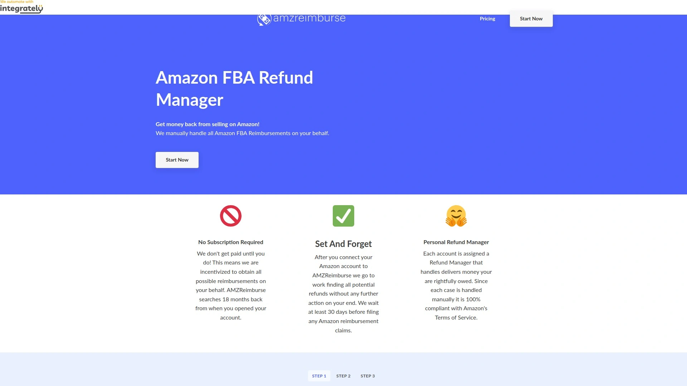

# 2025年最值得推荐的15款亚马逊FBA审计与赔付工具

亚马逊FBA卖家每年因库存丢失、损坏、费用超收等问题损失数十亿美元,但大多数卖家并未意识到这些资金可以追回。专业的FBA审计工具通过持续监控交易记录、自动识别差异并提交索赔申请,帮助卖家挽回高达3%年销售额的损失。2025年3月31日起,亚马逊赔付政策改为基于制造成本计算,这使得准确记录成本数据和使用专业审计工具变得更加关键。本文精选15款经过市场验证的FBA审计、赔付和库存管理工具,帮助你快速找到最适合自身业务规模和需求的解决方案,确保每一笔应得赔偿都不会流失。

## **[GETIDA](https://getida.com)**

FBA赔付领域的行业标杆,平均追回成功率高达90%。

GETIDA作为亚马逊授权销售合作伙伴,专注于FBA赔付审计已有多年经验,其专利技术每日审计数百亿美元的FBA交易数据。系统自动识别丢失库存、损坏商品、费用超收、入库差异、移除订单丢失等多达20余种赔付场景,无需卖家手动核对复杂报表。核心优势在于专业索赔团队能够将63%的先前失败案例重新提交并获得亚马逊批准,远超行业平均水平。平台提供实时追踪仪表板,卖家可随时查看审计进度、索赔状态和已追回金额,透明度极高。GETIDA的合规性经过亚马逊严格审查,曾参与Seller Central功能的Beta测试,确保所有操作符合亚马逊最新政策。客户成功团队提供一对一支持,根据卖家业务特点优化审计策略,无论是初创卖家还是年销售额数亿美元的企业品牌都能获得定制化服务。使用GETIDA的卖家平均比未使用审计工具的卖家多追回166%的赔付金额,这一数据来自数千家客户的真实统计。

## **[Helium 10 Managed Refund Service](https://www.helium10.com/tools/operations/managed-refund-service/)**

全托管赔付方案,审计18个月历史交易记录。

Helium 10的托管赔付服务采用白手套式端到端解决方案,由精英索赔专家团队负责全流程操作。系统自动审计卖家过去18个月的FBA交易,识别包括入库索赔、仓库索赔、客户退货索赔在内的多种赔付机会。专家团队代表卖家提交索赔申请并持续追踪进度,直至赔付资金到账,整个过程卖家只需通过专属案例管理器了解进度即可。服务覆盖库存在运输途中丢失、亚马逊合作承运商运输损坏、FBA入库时受损、亚马逊错误处置库存、仓库中遗失库存、包裹尺寸测量错误导致费用超收等场景。Diamond计划用户可直接激活此服务,激活后系统立即开始自动审计和提交索赔。用户可随时通过邮件联系停用服务,但已提交的成功索赔仍需支付相应费用。配合Helium 10的其他库存工具使用效果更佳,实现从产品研究到赔付追回的全链条管理。

## **[Seller Investigators](https://www.carbon6.io/seller-investigators/)**

Carbon6旗下高级审计工具,成功率高达95.9%。

Seller Investigators提供免费亚马逊赔付审计,通过先进算法在所有索赔类型中比竞品多追回20%资金。免费审计完成后,系统生成详细报告列出每笔可索赔金额和具体原因,卖家可清楚了解潜在赔付总额。专业团队深入挖掘复杂差异案例,包括库存丢失、产品损坏收入损失等多种情况。平台承诺无需前期付费,只有成功追回赔付后才收取服务费,降低卖家试用门槛。索赔提交流程简化高效,团队严格按照亚马逊政策操作,避免因违规导致账户风险。Seller Investigators在覆盖索赔类型、成功率和追回金额等关键指标上均优于其他赔付服务。适合希望最大化赔付追回且不想投入大量人力手动核对的中大型卖家。

## **[SellerBoard](https://sellerboard.com)**

实时利润分析平台,集成自动化赔付追踪功能。

SellerBoard专为亚马逊FBA卖家设计,提供精准的实时利润分析、库存管理和费用追踪。平台自动拉取卖家所有历史销售数据,无需手动导入即可分析过往表现。仪表板可自定义显示利润、预测和历史数据,卖家可按昨天、上月或过去三个月等时间段筛选查看。费用分析功能快速显示亚马逊收取的总费用和退款金额,无需从Seller Central拉取复杂报表。产品级ROI数据实时更新,帮助卖家评估单个产品表现并决策是否补货。成本管理功能允许精确输入商品成本,确保利润计算准确无误。图表视图支持自定义日期范围,直观展示销售单位、广告费用、净利润和退款趋势。损益表视图提供月度财务绩效综合概览,可按不同时间段筛选并查看各项费用明细。产品趋势工具监控特定产品随时间的表现,追踪利润、退款等关键指标。自动化赔付功能持续扫描丢失和损坏商品,简化索赔流程。

## **[AMZScout Reimbursement Service](https://learn.amzscout.net/reimbursement)**

拥有5年以上经验的专家团队,人工审计深度超越自动化工具。

AMZScout提供免费综合账户审计,由经验丰富的专家精准定位差异、丢失库存和潜在赔付机会。服务承诺比使用自动化工具多追回3倍资金,尤其适合数月或数年未进行赔付审计的卖家。平均每月帮助卖家追回至少1000美元,实际金额通常在1500-4000美元之间,具体取决于业务规模和积压案例数量。审计流程分三步:首先免费审计识别所有差异,然后技术团队努力追回应得资金,最后提供清晰详细的报告说明追回结果。真实案例显示,电子产品卖家Patrick因亚马逊履行中心丢失库存而困扰,提交请求后一个工作日内获得专家Hinda回应,五个工作日内完成审计并生成专业错误报告提交亚马逊,最终追回1350美元多笔款项。卖家需授予安全访问权限以便专家审计账户数据,整个过程透明可控。AMZScout已为众多卖家提供产品研究工具服务,赔付服务是其业务拓展的自然延伸。

## **[Refunds Manager](https://refundsmanager.com)**

专注1P供应商收入追回,成功率高达99%。

Refunds Manager简化一方供应商(1P Vendor)的收入追回流程,帮助供应商快速追回高达99%的损失收入。平台专门针对亚马逊供应商账户设计,与FBA卖家工具有显著区别,解决供应商特有的赔付问题。系统自动识别供应商账户中的短缺、损坏、定价错误等差异,无需供应商手动核对海量采购订单。承诺"这是你的钱,索取应得权益",强调帮助供应商追回本应属于他们的收入。服务流程高度自动化,供应商连接账户后系统立即开始审计,大幅减少人工投入时间。适合与亚马逊有直接供货关系的品牌商和制造商,特别是交易量大、SKU众多的企业。

## **[Jungle Scout](https://www.junglescout.com)**

综合性亚马逊卖家平台,提供产品研究到销售分析全流程工具。

Jungle Scout为超过100万卖家提供服务,累计协助创造500亿美元销售额。产品数据库涵盖超过4.75亿亚马逊产品,通过销售量、需求和盈利指标筛选找到高价值机会。机会发现工具自动识别高需求低竞争的产品关键词,为卖家提供蓝海市场洞察。关键词分析工具包括Keyword Scout和Rank Tracker,优化产品列表并追踪关键词排名变化。供应商数据库提供经过验证的供应商信息,帮助卖家评估发货历史并管理采购策略。销售分析功能生成利润概览和损益表,详细拆解收入和成本构成。自动化功能支持评论请求和促销活动管理,直接从平台执行营销任务。浏览器扩展插件在亚马逊页面内嵌关键产品洞察,方便实时分析。销售估算器已被超过100万卖家使用,准确预测月度销量并支持产品发布决策。平台支持多个亚马逊市场,方便卖家拓展全球业务。

## **[InventoryLab](https://inventorylab.com)**

FBA发货流程自动化专家,从扫描到发货一站式解决。

InventoryLab现已整合入Seller 365套件,仅需69美元/月即可获得10款应用。核心优势在于简化复杂的FBA准备流程,让卖家专注业务增长而非繁琐操作。10秒产品设置功能通过智能定价工具和直观表单,将产品添加时间从分钟级缩短至秒级。智能装箱功能自动创建发往亚马逊的箱子,消除手动计算和规划的麻烦。实时费用追踪让卖家在每个阶段都清楚了解所有成本,做出最大化利润的明智选择。零错误工作流记住每个团队成员的决策和数据输入,确保不遗漏任何重要细节。智能标签中心自动格式化并验证每个标签符合亚马逊精确规范,彻底消除标签错误和拒收问题。完美文档功能自动追踪每件商品并生成准确的箱内清单,防止亚马逊仓库延误。系统通过亚马逊Selling Partner API与卖家账户通信,自动同步所有库存和60天历史销售数据。财务报表自动整合亚马逊费用数据,包括履行费、仓储费等,节省手动追踪时间。

## **[RestockPro](https://www.ecomengine.com/restockpro)**

FBA库存管理自动化领导者,精准预测补货需求。

RestockPro专注于自动化FBA库存和履行工作流的核心部分,智能算法生成建议补货数量防止断货。强大的采购订单管理工具支持自动化创建和追踪采购,简化供应链管理。一键工具简化FBA发货创建和入库库存追踪,大幅提升操作效率。补货建议基于卖家自行控制的设置生成,而非亚马逊的标准建议,保护卖家的供应商信息、成本和利润率不被亚马逊获取。平台提供SKU盈利能力、销售趋势和供应商绩效的深入洞察,帮助做出明智的库存决策。端到端供应链管理功能覆盖创建采购订单、打印定制标签、发货至亚马逊、创建套装/捆绑等全流程。库存绩效概览仪表板集中展示所有关键数据,一目了然地了解库存表现。价格从49美元/月起步,根据订单量灵活调整。年度计划相当于支付10个月享受12个月服务,具备成本优势。预测准确性高,移除库存管理中的猜测和电子表格,明确知道何时补货多少数量。

## **[Viral Launch](https://viral-launch.com)**

亚马逊卖家全方位解决方案,助力新手到专家的成长路径。

Viral Launch为超过30万知名品牌提供服务,累计推动340亿美元以上产品销售,成功售出12亿以上产品。产品研究工具通过市场洞察帮助卖家发现高需求低竞争的利基市场和产品创意。关键词优化功能识别高影响力低竞争关键词,平均实现4倍广告投资回报率。利润计算器提供精准预测,轻松比较不同产品的价格、收入和FBA费用。产品追踪功能确保卖家不错过任何市场机会,监控产品创意、评估销售趋势并识别季节性变化。浏览器扩展提供实时销售数据即时访问,深入产品数据库可查询历史销售、Best Seller排名、评论、评级和机会分数。供应商管理工具帮助卖家可靠采购产品并管理供应链。评论自动化功能简化买家评论请求流程,提升产品声誉。新卖家专属资源提供从入门到畅销的分步指南,超越基础知识帮助新手成功。适合首次销售者和寻求扩大业务规模的成熟卖家。

## **[AMZRefund / AMZReimburse](https://amzreimburse.com)**

自动化赔付发现工具,连接账户后即开始工作。

AMZReimburse连接亚马逊账户后自动开始查找所有潜在退款,无需卖家进一步操作。系统等待至少30天后才提交索赔,确保亚马逊有足够时间自行处理差异,避免过早提交导致拒绝。覆盖的赔付场景包括亚马逊未赔偿销毁的单位、客户获得退款但卖家未收回商品、FBA费用错误收费等。工具计算包括未经赔偿销毁库存、客户退货差异、入库短缺和费用错误在内的多种情况。界面简洁易用,卖家无需学习复杂操作即可开始使用。承诺成功追回赔付前无需付款,降低卖家使用门槛。AMZ RefundMe品牌提供类似服务,帮助卖家追回亚马逊欠款。适合希望低投入自动化赔付追踪的小型卖家。

## **[SoStocked](https://www.sostocked.com)**

智能库存管理软件,优化FBA库存预测和补货决策。

SoStocked专注于帮助亚马逊卖家管理库存转移和FBA发货等任务,提升运营效率。供应商管理功能便于存储和管理供应商详细信息,集中维护供应链联系人。库存估值功能实时计算库存总价值,帮助卖家了解资金占用情况。预测算法基于历史销售数据和市场趋势,准确预测未来需求并给出补货建议。平台支持多渠道库存同步,适合在亚马逊和其他平台同时销售的卖家。界面设计注重用户体验,即使是库存管理新手也能快速上手。通过避免断货和过度库存,帮助卖家优化现金流和仓储成本。

## **[Helium 10 Refund Genie](https://www.helium10.com/tools/operations/refund-genie/)**

自动化FBA赔付流程,确保不遗漏任何合格索赔。

Refund Genie作为Helium 10的赔付管理器,自动化FBA赔付流程并确保卖家不错过任何符合条件的索赔。工具简化赔付流程并保持手动控制灵活性,卖家可根据需要介入特定案例。扫描卖家账户识别丢失或损坏库存、费用错误等赔付机会,生成可提交的索赔列表。集成在Helium 10平台内,与其他运营工具如库存管理和利润分析无缝协作。定期运行审计确保持续监控新出现的赔付机会,不会因疏忽而损失资金。曾包含在Platinum计划中,但部分功能调整后需升级到更高计划或使用Managed Refund Service。适合已使用Helium 10其他工具并希望添加赔付追踪功能的卖家。

## **[Veeqo](https://www.veeqo.com)**

多渠道库存同步专家,提供运输折扣优势。

Veeqo在统一多渠道销售的库存同步方面表现出色,同时提供优惠的运输费率。平台连接亚马逊、Shopify、eBay等多个销售渠道,实时同步库存数量避免超卖。运输管理功能整合主要承运商,提供折扣标签打印服务,降低物流成本。订单集中在统一仪表板处理,简化多渠道订单履行流程。库存自动更新机制确保各平台库存数据实时一致,减少人工核对工作量。适合在亚马逊FBA之外还运营其他电商渠道的卖家,特别是需要统一管理多平台库存的中型企业。

## **[Linnworks](https://www.linnworks.com)**

企业级多渠道管理系统,最受大型卖家欢迎。

Linnworks是企业级卖家最常用的多渠道库存管理解决方案,功能强大覆盖全面。平台支持与数百个销售渠道、市场和物流服务商集成,实现真正的全渠道运营。高级自动化规则引擎允许卖家创建复杂的业务逻辑,自动处理订单路由、库存分配等任务。库存集中管理跨越多个仓库和销售渠道,提供实时可见性和控制。强大的报表功能生成详细的销售、库存和绩效分析,支持数据驱动决策。适合年销售额较高、运营复杂度大、需要企业级可扩展性的大型卖家和品牌。定价灵活根据业务规模定制,通常面向高交易量客户。

## **[Finale Inventory](https://www.finaleinventory.com)**

多渠道电商库存解决方案,支持FBA与Shopify等平台。

Finale Inventory是唯一支持FBA、Shopify、Walmart等平台多变工作流程的多渠道电商库存方案。平台设计灵活适应不同履行模式,无论是FBA、自发货还是混合模式都能无缝管理。实时库存追踪确保准确库存水平,减少断货和过度库存风险。订单管理功能整合多个销售渠道订单,集中处理提升效率。条码扫描和移动应用支持仓库操作,提升拣货打包准确性。适合需要高度定制化库存管理解决方案的中大型卖家,尤其是同时运营多个履行渠道的企业。提供演示版本,卖家可在购买前充分测试功能是否符合需求。

**如何选择适合自己业务的FBA审计工具?**

根据业务规模和审计需求选择工具类型:年销售额100万美元以下的小型卖家可优先考虑AMZReimburse、Refund Genie等入门级自动化工具,投入较低且能覆盖基础赔付场景。年销售额100万-500万美元的中型卖家适合使用GETIDA、Seller Investigators等专业服务,人工审计团队能挖掘更多复杂案例。大型企业和品牌建议选择Helium 10 Managed Refund Service或SellerBoard,配合全面的利润分析和库存管理功能实现整体优化。如果数月或数年未进行赔付审计,应选择提供18个月历史审计的服务如Helium 10或AMZScout,一次性追回积压赔付。

**2025年亚马逊赔付政策变化对卖家有何影响?**

2025年3月31日起,亚马逊对FBA库存丢失或损坏的赔付从基于销售价格改为基于制造成本计算。制造成本仅包括从制造商、批发商或经销商处采购产品的金额,不包括运输、处理、关税等相关费用。这一变化导致部分卖家的赔付金额下降高达75%,尤其是非制造成本占比高的卖家受影响严重。卖家可通过Seller Central的"管理制造成本"页面主动提交实际制造成本,而非使用亚马逊估算值,确保获得公平赔付。保持详细的供应商发票和制造费用记录变得至关重要,准确的成本数据直接影响赔付金额。客户订单后丢失或损坏的商品仍按原订单销售价格扣除相关费用后赔付,不受新政策影响。

**专业审计服务比自己手动索赔有哪些优势?**

专业审计工具每日自动扫描数百亿美元交易数据,识别超过20种赔付场景,远超卖家手动核对报表的效率。经验丰富的索赔团队熟悉亚马逊政策和审核标准,能将先前失败案例重新提交并获得63%的批准率。自动化系统可追溯18个月历史交易,挖掘被遗忘的积压赔付机会,而手动审计通常只关注近期数据。复杂案例如入库差异、尺寸重量错误、移除订单丢失等需要专业知识和详细证据,专家团队处理成功率显著高于个人卖家。持续追踪功能确保提交的索赔得到处理,避免因亚马逊延误或需要补充材料而放弃索赔。卖家可将节省的时间投入产品开发、营销等核心业务,专业服务的投资回报率通常远高于人工成本。

亚马逊FBA审计与赔付工具已成为卖家保护利润的必备武器,特别是在2025年赔付政策调整后更显重要。从自动化工具到全托管服务,从入门级到企业级解决方案,本文介绍的15款工具覆盖各种业务规模和需求场景。**[GETIDA](https://getida.com)**凭借90%的索赔成功率和166%的超额追回表现,特别适合追求专业审计深度和最大化赔付金额的卖家,其专利技术和授权合作伙伴身份确保合规性和可靠性。建议卖家先进行免费审计了解潜在赔付金额,再根据业务特点选择2-3款工具对比测试,最终选定最符合自身需求和预算的长期解决方案。
